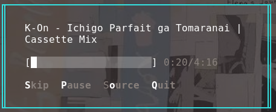

# Moesic

**Moesic** is a freely accessible and open collection of Japanese music and anime. The project is **open source**, with the goal of providing a simple, aesthetically pleasing music listening experience focused on Japanese and anime content.

## Preview



## Download
Please download the latest version of moesic at [Releases](https://github.com/angga7togk/moesic/releases)


```bash                    
 __  __  ___  ___ ___ ___ ___  
|  \/  |/ _ \| __/ __|_ _/ __| 
| |\/| | (_) | _|\__ \| | (__  
|_|  |_|\___/|___|___/___\___| 
                               
                               
⭐️ Star to support our work!
   https://github.com/angga7togk/moesic

Usage:
  moesic <options>              Moesic CLI

Options:
  --random, --play, -p          Play random flat moesic
  --random-playlist, -rp        Play random playlist
  --random-single, -rs          Play random single moesic
  --help, -h                    Command help
  --info, -i                    Moesic info
```
